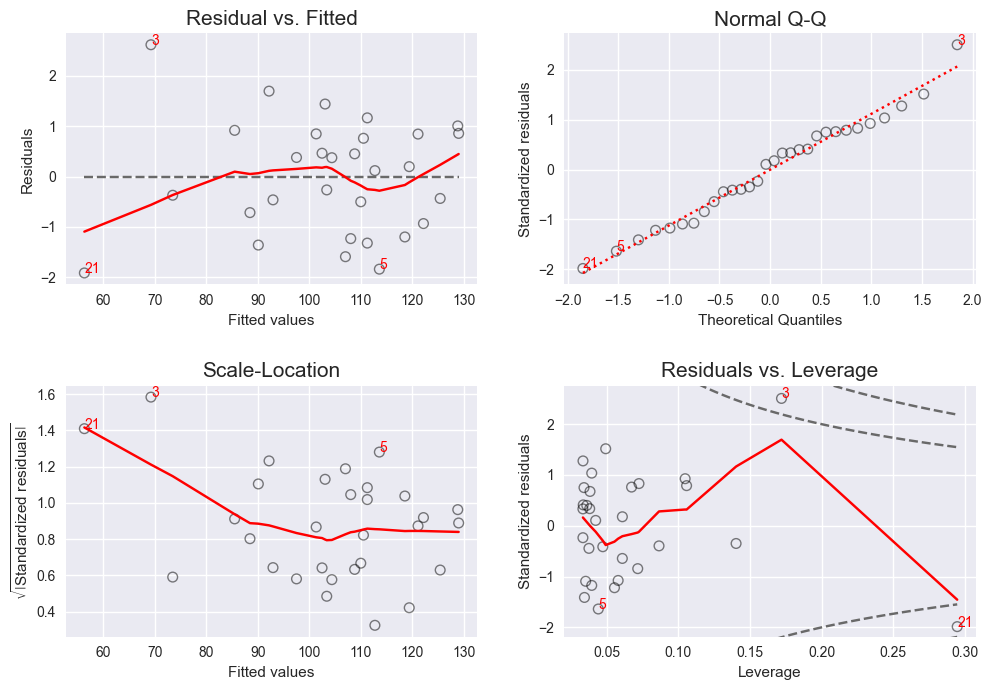

lmdiag
=======

**Python Library providing Diagnostic Plots for Lineare Regression Models.** Similar to `plot.lm <https://www.rdocumentation.org/packages/stats/versions/3.5.0/topics/plot.lm>`_ in R.

I build this, because I missed the diagnostics plot of R. There are some substitutions for individual charts, but they are spread over different libraries and sometimes are not showing the exact same. My implementations tries to copycat the R-plots, but I didn't reimplement the R-code: The charts are just based on the available documentation.

Installation
------------

- Using pip: ``pip install lmdiag``
- Using pipenv: ``pipenv install lmdiag``

Usage
-----------

The plots need a `fitted Linear Regression Model <http://www.statsmodels.org/dev/generated/statsmodels.regression.linear_model.OLS.fit.html>`_ created by statsmodels as input.

Example
........

::

        import numpy as np
        import matplotlib.pyplot as plt
        import statsmodels.api as sm
        import lmdiag

        %matplotlib inline  # In Jupyter

        # Generate sample model
        np.random.seed(20)
        predictor = np.random.normal(size=30, loc=20, scale=3)
        response = 5 + 5 * predictor + np.random.normal(size=30)
        X = sm.add_constant(predictor)
        lm = sm.OLS(response, X).fit()

        # Plot chart matrix (and enlarge figure)
        plt.figure(figsize=(10,7))
        lmdiag.plot(lm);

Result
........

Methods
........

- Draw matrix of all plots:

  ``lmdiag.plot(lm)``

- Draw individual plots:

  ``lmdiag.resid_fit(lm)``

  ``lmdiag.q_q(lm)``

  ``lmdiag.scale_loc(lm)``

  ``lmdiag.resid_lev(lm)``

- Print useful descriptions for interpretations:

  ``lmdiag.info()`` (for all plots)

  ``lmdiag.info('<method name>')`` (for individual plot)

Development
------------

Disclaimer
..........

This is my very first public python library. Don't expect everything to work smoothly. I'm happy to receive helpful fedback or pull requests.

Packaging and Upload to PyPi
............................

- ``python setup.py sdist``
- ``python setup.py bdist_wheel``
- ``twine upload dist/*``
